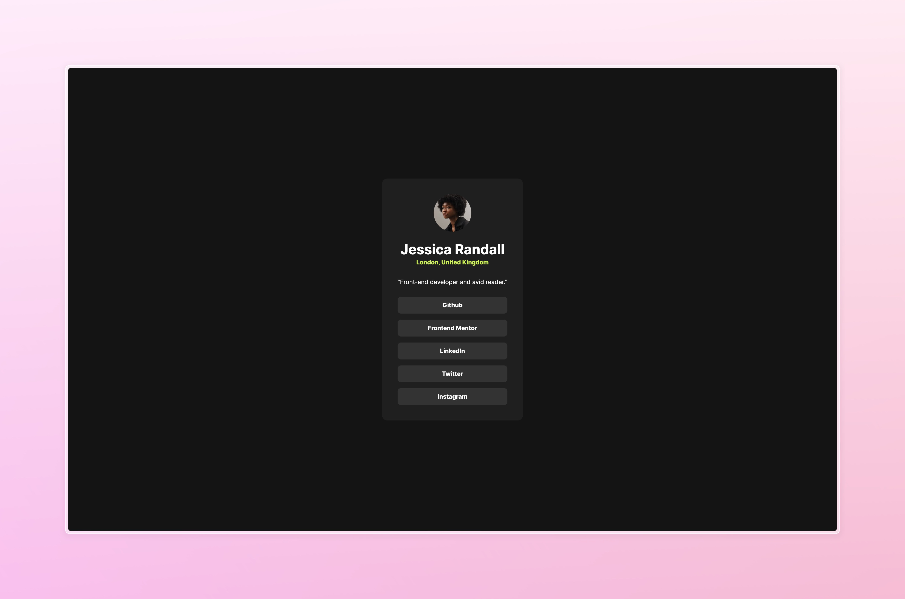

# Social Links Profile Main

## Overview

This component is made with plan HTML and CSS, using custom variables for design consistency and easy to collorate code.

### Screenshot

### Links

- Live Site URL: [Add live site URL here](https://social-links.mananqayas.com/)

## My process

### Built with

- Semantic HTML5 markup
- CSS custom properties
- Flexbox
- CSS Grid
- Mobile-first workflow

## Author

- Website - [Manan Qayas](https://www.mananqayas.com)
- Twitter - [@mananqayas](https://www.twitter.com/mananqayas)

## Acknowledgments

This is a simple component using flex box and accurate design specs are applied using CSS variables for consistency and error proofing.
